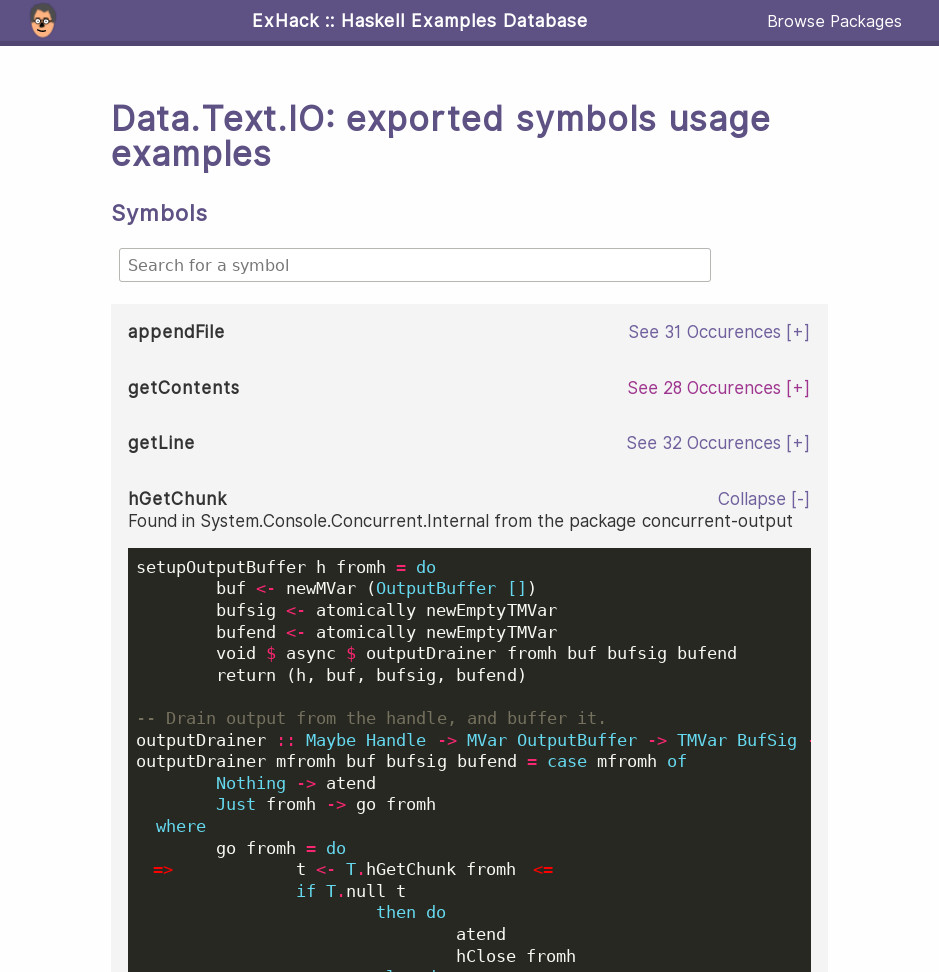

# Ex-Hack: Hackage Example Database

[](https://circleci.com/gh/NinjaTrappeur/ex-hack)

[](https://exhack.org)

*[Ex-Hack-tement Jamy!](https://en.wikipedia.org/wiki/Jamy_Gourmaud)*

Ex-Hack, shorthand for Hackage EXamples is a Haskell
example-based documentation.

https://exhack.org

**Note: This is an alpha release. See the How to Contribute section to help us
making this tool more reliable/complete.**



## Abstract

Ex-Hack is a CLI tool able to generate an example-based documentation from a
stackage build plan.

It may be useful:

- For stackage users to learn how to use a library missing proper documentation 
- For library maintainers as a way to see which symbols are mostly used in the
  wild before performing an API refactoring.

**/!\ Again, this is an alpha release.** We may miss a lot of symbols
occurrences, please do not use this tool as a way to assess your API usage yet.

## How to Use?

1. Build and install ex-hack.
1. Download a Stackage build plan from [this
   repo](https://github.com/commercialhaskell/lts-haskell). **Note**: Ex-Hack
   not yet compatible with the GHC 8.6 line.
1. Run ex-hack -s ${stackageFile} to generate the documentation. **Note**: this
   process will download, build and index the whole Stackage packages. It will
   take quite some time.  

## How to Contribute?

First, pick an issue labelled as
[todo](https://github.com/NinjaTrappeur/ex-hack/issues?q=is%3Aissue+is%3Aopen+label%3ATodo),
fork the project, fix the issue, add some tests and open a PR.

We use this repository as main form of communication. If you have some
questions/need a more informal channel to get in touch with us, you can join
the [#ex-hack](http://webchat.freenode.net?channels=%23ex-hack) channel on the
freenode irc network.

## Architecture Overview

The software is built around the `processing step` notion. Basically, a
processing step is an atomic transformation applied to every package. Each
processing step is dependent from the previous one and is a dependency for the
next one.

Because of this, every processing step can be distributed on several processes
or machines using a map/reduce strategy.

There are currently 8 processing steps:

1. **Generate database scheme**: initialize the database.
2. **Parse the Stackage YAML description**: parse the stackage YAML file.
3. **Download assets (cabal + tarballs)**.
4. **Generate the package dependency graph**: generate a dependency graph using
   the downloaded cabal files.
5. **Save the dependency graph to the database**.
6. **Retrieve the packages exported symbols**: for each package, we will look
   for an exposed library, load and type-checking it in GHC using the GHC API to
   finally retrieve all of the exported symbols.
7. **Index the used symbols**: we parse every source file of every package and
   look for occurrences of the symbols retrieved in the previous step.
8. **Generate the HTML documentation**: we render the ex-hack SQLite database
   into a static HTML documentation. This documentation can either be served on
   the web, or consulted locally.


## Development Tooling

You can either use [Nix](https://nixos.org/nix/) or
[Stack](https://hackage.haskell.org/package/stack) to build/install ex-hack.

Both the project's maintainer and the CI are using Nix as the primary build
tool, the stack build may be broken. If that's the case, please open an issue
and submit a PR fixing the issue (if you can :)).

**Note:** You don't necessarily need NixOS to use Nix, you probably can do it on your
favorite OS.

### How to Generate the Doc?

Once you installed ex-hack, you can download a Stackage build plan and generate
the associated documentation with

```
ex-hack -s stackage_file.yml
```

By default, the files will be generated in your `XDG_DATA/ex-hack/output` directory.
That will be `.local/share/ex-hack/output` on Linux. Once generated, you can
either copy this static HTML documentation to the web-server you want to deploy
it onto or spawn a small local web-server to browse it.

These directory can be overridden, check out the appropriate flags using the
`--help` argument.

You may want to save the logs on top of displaying them:

```
ex-hack -s lts-12.11.yaml 2>&1 | tee ex-hack-run.log
```

### How to Install?

#### Using Cachix as Binary Cache

TODO

#### With Nix

```
cd ${ex-hack dir}
nix-env -f default.nix -iA ex-hack
```

#### With Stack

Check that the `./local/bin` directory is in your `$PATH`.  

```
cd ${ex-hack dir}
stack install
```

### How to Build?

#### Using Nix

To work on ex-hack interactively:

```
nix-shell 
cabal build
```

To test the nix release system:

```
nix-build
```

#### Using Stack

```
stack build
```

### How to Test? 

There are currently two test suites: a unit one and an integration one.

Running the integration test suite can take quite some time (~1 minute on my
7yo desktop). 

#### Using Nix

```
nix-shell 
# Run both the unit and integration tests
cabal test
# Run unit tests only
cabal test unit-tests
# Run integration tests only
cabal test integration-tests
```

Unfortunately, you can't test ex-hack using the nix-build command. For some
reason, cabal-helper doesn't like being used from within the nix-store
environment.

#### Using Stack

```
stack test
```

### How to Profile?

You'll either need to build the nix expression with the profile parameter
enabled:

```
nix-shell --arg profile true
#or
nix-build --arg profile true
```
If you are interactively using cabal to build and debug your project, you can
enable the profiling by using:

```
cabal configure --enable-profiling --flags=profiling
cabal build
```

Then, use the regular [RTS profiling
options](https://downloads.haskell.org/~ghc/latest/docs/html/users_guide/profiling.html)
to either profile the heap or get an overview of the cost centers.
